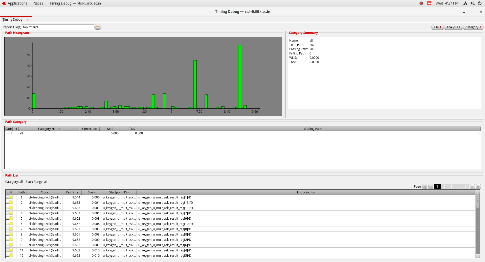
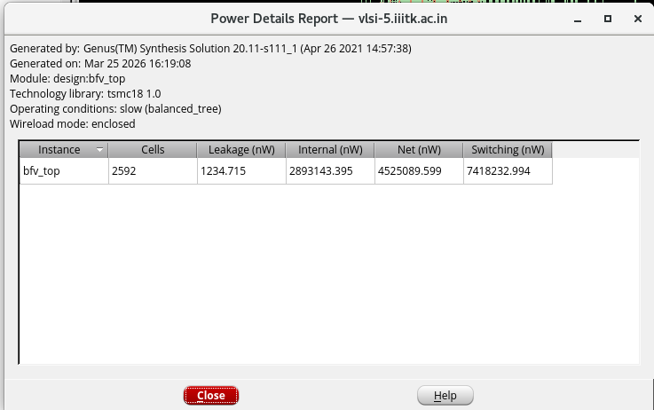
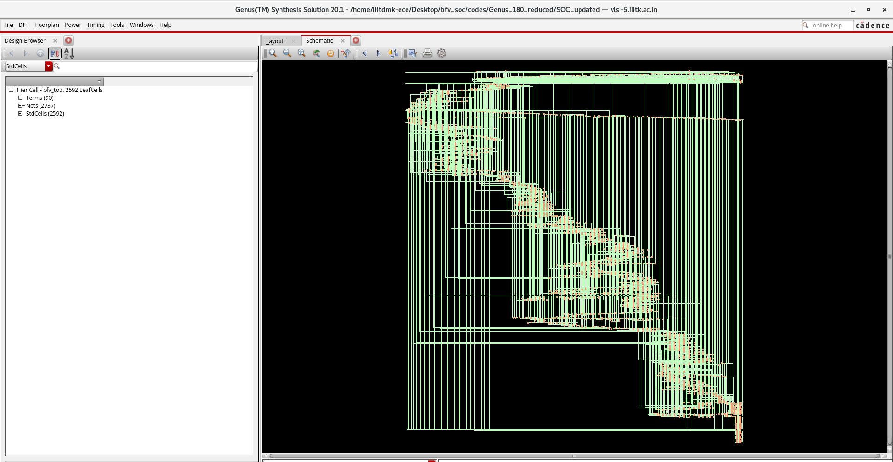
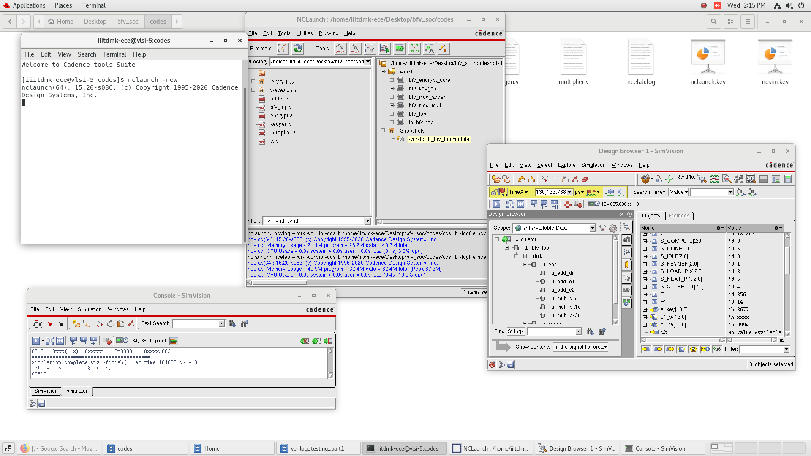
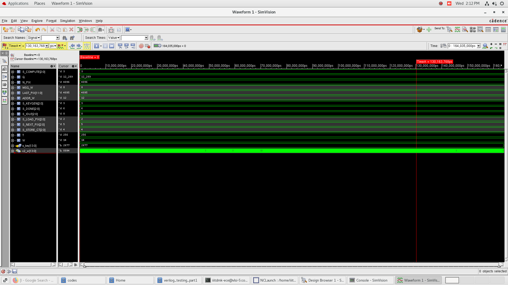

# 🔐 BFV Homomorphic Encryption — ASIC Implementation (180nm & 90nm)

> **Hardware accelerator for BFV (Brakerski/Fan-Vercauteren) Homomorphic Encryption** targeting pixel-level image encryption. Synthesized with Cadence Genus and placed-and-routed with Cadence Innovus on TSMC 180nm and 90nm standard-cell libraries.

---

## 📋 Table of Contents
- [Overview](#overview)
- [Architecture](#architecture)
- [Module Hierarchy](#module-hierarchy)
- [Design Parameters](#design-parameters)
- [Synthesis Results](#synthesis-results)
- [Physical Design (Innovus)](#physical-design-innovus)
- [Simulation](#simulation)
- [Repository Structure](#repository-structure)
- [Tools Used](#tools-used)
- [How to Run](#how-to-run)

---

## Overview

This project implements the **BFV Fully Homomorphic Encryption (FHE)** scheme in RTL (Verilog) for ASIC synthesis. The accelerator encrypts 4096 pixels of 8-bit image data using:

- **Key Generation** — Computes public key pair `(pk1, pk2)` from secret key, random polynomial, and error
- **Pipelined Modular Arithmetic** — Custom modular adder and Barrett-reduction-based multiplier (mod *q* = 12289)
- **FSM-driven Encryption** — 11-state pipelined FSM loads pixels from memory, encrypts each via BFV, and stores ciphertexts

The entire design has been **synthesized at 100 MHz** with **zero timing slack** on both 180nm and 90nm technology nodes.

---

## Architecture

The top-level module `bfv_top` orchestrates the encryption pipeline:

```
                ┌───────────────┐
    sk, a, e ──►│  bfv_keygen   │──► pk1, pk2
                │ (mod_mult +   │
                │  mod_adder)   │
                └───────┬───────┘
                        │
                        ▼
  pixel_mem ──► ┌───────────────────┐ ──► enc_c1[], enc_c2[]
                │ bfv_encrypt_core  │     enc_combined[]
  LFSR u,e1,e2►│ (mod_mult ×2 +    │
                │  mod_adder ×3)    │
                └───────────────────┘
```

**FSM States:**
`IDLE → KEYGEN_W1 → KEYGEN_W2 → KEYGEN → LOAD_PIX → COMPUTE_1 → COMPUTE_2 → COMPUTE_3 → STORE_CT → NEXT_PIX → DONE`

---

## Module Hierarchy

| Module | Description |
|--------|-------------|
| `bfv_top` | Top-level FSM controller with pixel memory and ciphertext storage |
| `bfv_keygen` | Public key generation: `pk1 = -(a·sk + e) mod q`, `pk2 = a` |
| `bfv_encrypt_core` | BFV encryption: computes `c1`, `c2` from plaintext and public key |
| `bfv_mod_mult` | Pipelined modular multiplier with Barrett reduction (mod 12289) |
| `bfv_mod_adder` | Modular adder with single-cycle reduction |

---

## Design Parameters

| Parameter | Value | Description |
|-----------|-------|-------------|
| `W` | 14 bits | Coefficient word width |
| `Q` | 12289 | Ciphertext modulus (NTT-friendly prime) |
| `MSG_W` | 8 bits | Plaintext message width (pixel) |
| `T` | 256 | Plaintext modulus |
| `N_PIX` | 4096 | Number of pixels to encrypt |
| `ADDR_W` | 12 bits | Memory address width |
| Clock | 100 MHz | Target frequency (10 ns period) |

---

## Synthesis Results

Synthesis was performed using **Cadence Genus 20.11** under slow operating conditions with balanced tree optimization.

### Comparison Table

| Metric | 180nm | 90nm |
|--------|-------|------|
| **Cell Count** | 2,592 | 2,153 |
| **Total Area** | 43,582.49 µm² | 12,789.34 µm² |
| **Total Power** | 7.42 mW | 1.45 mW |
| **Leakage Power** | 1.23 µW | 53.05 µW |
| **Switching Power** | 4.53 mW (61.0%) | 0.70 mW (48.1%) |
| **Internal Power** | 2.89 mW (39.0%) | 0.70 mW (48.2%) |
| **Worst Slack** | 0 ps (MET) | 0 ps (MET) |
| **Clock Period** | 10 ns (100 MHz) | 10 ns (100 MHz) |

### 180nm — Genus Timing Report


### 180nm — Genus Power Report


### 180nm — Schematic


### 90nm — Timing Report


### 90nm — Power Report


### 90nm — Schematic


---

## Physical Design (Innovus)

Place-and-route was performed using **Cadence Innovus** on the 180nm node. The flow includes floorplanning, power planning, placement, CTS, NanoRoute, and GDS export.

### Floorplan
| Floorplan Boundary | Floorplan View |
|---|---|
|  |  |

### Power Network


### Special Route


### Post-Route (NanoRoute)


### Final Chip Layout
| Front View | Back View |
|---|---|
|  |  |


### Signoff Reports
- ✅ **DRC** — see [`bfv_top.drc.rpt`](bfv_top.drc.rpt)
- ✅ **Connectivity** — see [`bfv_top.conn.rpt`](bfv_top.conn.rpt)
- ✅ **Antenna** — see [`bfv_top.antenna.rpt`](bfv_top.antenna.rpt)

---

## Simulation

RTL simulation was performed using **Cadence NCLaunch** to verify functional correctness before synthesis.

| NCLaunch Environment | Simulation Waveform |
|---|---|
|  |  |

---

## Repository Structure

```
.
├── bfv_top.v                        # Top-level module (180nm)
├── bfv_keygen.v                     # Key generation module
├── bfv_encrypt_core.v               # BFV encryption core
├── bfv_mod_mult.v                   # Pipelined modular multiplier
├── bfv_mod_adder.v                  # Modular adder
├── bfv_pipelined_180nm.sdc          # Timing constraints (180nm)
├── run_genus_pipelined_180.tcl      # Genus synthesis script
├── bfv_180nm_pipelined_netlist.v    # Post-synthesis netlist
├── bfv_180nm_pipelined_*.rpt        # Synthesis reports (area/power/timing/gates)
├── bfv_top_180_gds.gds              # Final GDSII layout
├── bfv_top.dat/                     # Innovus database
├── timingReports/                   # Pre/post-CTS timing reports
├── Pictures/                        # 180nm screenshots (Genus + Innovus)
│
├── 90 nm/                           # ── 90nm variant ──
│   ├── bfv_top.v                    # Top-level (90nm)
│   ├── bfv_*.v                      # RTL sources
│   ├── bfv_pipelined_90nm.sdc       # Timing constraints (90nm)
│   ├── run_genus_pipelined_90.tcl   # Genus script
│   ├── bfv_90nm_pipelined_*.rpt     # Synthesis reports
│   └── Pictures/                    # 90nm screenshots
│
└── fv/                              # Formal verification data
```

---

## Tools Used

| Tool | Version | Purpose |
|------|---------|---------|
| **Cadence Genus** | 20.11-s111_1 | RTL Synthesis |
| **Cadence Innovus** | 20.x | Place & Route, GDS export |
| **Cadence NCLaunch** | — | RTL Simulation |
| **TSMC 180nm** | `t018s6mm` | Standard cell library |
| **TSMC 90nm** | — | Standard cell library |

---

## How to Run

### Synthesis (Genus)
```bash
# 180nm
genus -f run_genus_pipelined_180.tcl

# 90nm
cd "90 nm"
genus -f run_genus_pipelined_90.tcl
```

### Place & Route (Innovus)
Load the saved design database:
```bash
innovus
# Inside Innovus:
source bfv_top.dat/viewDefinition.tcl
```

---

## 📜 License

This project is part of an academic SoC design course. For educational and research purposes.

---

<p align="center">
  <b>BFV Homomorphic Encryption Hardware Accelerator</b><br>
  Designed for TSMC 180nm & 90nm · Synthesized with Cadence Genus · P&R with Cadence Innovus
</p>
